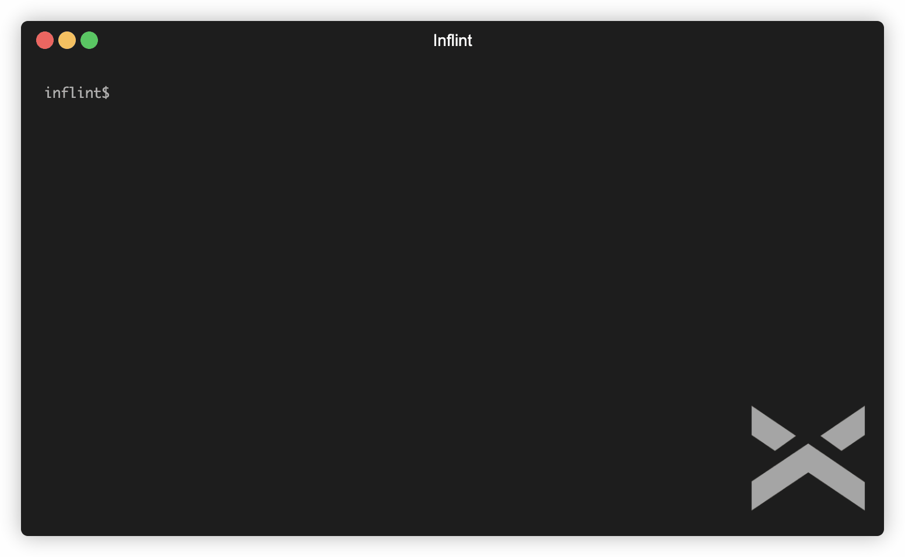

<p align="center">
	<a href="https://github.com/tal-rofe/inflint">
    	
  	</a>
	<a href="https://www.npmjs.com/package/@exlint.io/inflint">
    	
  	</a>
	<a href="https://github.com/tal-rofe/inflint">
    	
  	</a>
	<a href="https://github.com/tal-rofe/inflint">
    	
  	</a>
</p>

<p>&nbsp;</p>

<p align="center"></p>

<h2 align="center">Inflint</h2>

> Inflint is a tool which scans and verifies files and folders name conventions.

Inflint allows you to easily set file names convention in your repository.

## Demo



## Installation

**Globally**

```bash
npm install --global @exlint.io/inflint
```

**Locally**

```bash
npm install --save-dev @exlint.io/inflint
```

## Usage

```sh
$ inflint [options] [files]
```

## ESM support

Inflint now supports **only** ESM modules, from version `>1.2.10`. For any issue regarding this, please visit this link https://gist.github.com/sindresorhus/a39789f98801d908bbc7ff3ecc99d99c

## Configuration

You can specify the configuration of Inflint through various options.
Configuration can be set in the following files:

-   a `package.json` property: `"inflint": {...}`
-   a `.inflintrc` file in JSON or YAML format
-   a `.inflintrc.json`, `.inflintrc.yaml`, `.inflintrc.yml`, `.inflintrc.js`, `.inflintrc.ts`, or `.inflintrc.cjs` file
-   a `inflint.config.ts`, `inflint.config.js`, or `inflint.config.cjs` CommonJS module exporting an object

### Rules format
When applying rules either via the CLI or other configuration, you must follow the rules format.
"`1`" and "`warn`" are warnings rules, "`2`" and "`error`" are errors rules.
Each rule has key and value. The key represents the glob pattern. When a file matches the pattern, it will be enforced by the rule.
The rule value represents the rule enforcement.

**Rules enforcement format:**
- Set rules of files-existence: `1 | 2 | 'warn' | 'error' | [1] | [2] | ['warn'] | ['error']`

  **Example**: `{ './src/**/*': 2 }` &rarr; Inflint emits an error if there are any files/folders inside "src" folder
- Set rules to match file names conventions: `[1, <convention>] | [2, <convention>] | ['warn', <convention>]| ['error', <convention>]`

  **Example**: `{ './src/**/*': [1, 'kebab-case'] }` &rarr; Inflint emits an error if there are any files/folder which do not match the "kebab-case" convention name inside "src" folder.
- Set rules options: `[1, <convention>(optional), <options>] | [2, <convention>(optional), <options>] | ['warn', <convention>(optional), <options>] | ['error', <convention>(optional), <options>]`

  **Example1**: `{ './src/**/*': [1, { onlyFiles: true }] }` &rarr; Inflint emits an error if there are any files inside "src" folder (and allows folders to exist)
  
  **Example2**: `{ './src/**/*': [1, 'point.case', { onlyFiles: true }] }` &rarr; Inflint emits an error if there are any files which do not match the "point-case" convention name inside "src" folder (and allows folders inside "src" folder not to match the "point.case" pattern)


> If you provide unknown convention which isn't known one or a configured alias, Inflint considers the "convention" as regex.

### Rule option
You can set options for any rule, in order to get some customization.
- `onlyDirectories`: Boolean (default: `false`)
  
  Inflint checks the rule with directories only, skips files.

- `onlyFiles`: Boolean (default: `false`)

  Inflint checks the rule with files only, skips directories.

- `dot`: Boolean (default: `true`)

  Allow Inflint to match files and directories starting with a period (`.`).

- `caseSensitiveMatch`: Boolean (default: `true`)

  Enables a case-sensitive mode for matching files and folders.

### File names conventions
You can set file names conventions rules using known ones. Inflint allows you to set the following:
| Convention                 | Alias                        | Description                                                                                       | 
| :------------------------- | :--------------------------- | :------------------------------------------------------------------------------------------------ |
| lowercase                  | `lowercase`                  | Every letter must be lowercase. Ignores non-letters                                               |
| camelcase                  | `camelCase`                  | Must be in "camelCase" format. Only letters and digits are allowed                                |
| camelcase-point            | `camelCase.point`            | Must be in "camelCase" format. Only letters, digits and `.` are allowed                           |
| pascalcase                 | `PascalCase`                 | Must be in "PascalCase" format. Only letters and digits are allowed                               |
| pascalcase-point           | `PascalCase.Point`           | Must be in "PascalCase" format. Only letters, digits and `.` are allowed                          |
| snakecase                  | `snake_case`                 | Must be in "snake_case" format. Only lowercase letters, digits and `_` are allowed                |
| snakecase-point            | `snake_case.point`           | Must be in "snake_case" format. Only lowercase letters, digits, `_` and `.` are allowed           |
| screamingsnakecase         | `SCREAMING_SNAKE_CASE`       | Must be in "SCREAMING_SNAKE_CASE" format. Only uppercase letters, digits and `_` are allowed      |
| screamingsnakecase-point   | `SCREAMING_SNAKE_CASE.POINT` | Must be in "SCREAMING_SNAKE_CASE" format. Only uppercase letters, digits, `_` and `.` are allowed |
| kebabcase                  | `kebab-case`                 | Must be in "kebab-case" format. Only lowercase letters, digits and `-` are allowed                |
| kebabcase-point            | `kebab-case.point`           | Must be in "kebab-case" format. Only lowercase letters, digits, `-` and `.` are allowed           |
| pointcase                  | `point.case`                 | Must be in "point.case" format. Only lowercase letters, digits and `.` are allowed                |

### CLI Rules
When adding rules via the CLI, you need to provide a valid JSON for the `--rule` argument. You can provide multiple rules.
The JSON should follow the rules format described above.

**Example**: `inflint --rule "{ \"src/**/*\": [1] }"`

### Aliases
You can use the known conventions, or you can add your own by applying aliases, via the CLI or other configuration.
To use the aliases, simply use the alias name as you would use a known convention.
Aliases should be applied with the following format:
- `<alias_name>: <regex>` Inflint will apply the alias name to match the provided regex.

  **Example**: Applying the alias `{ myAlias: '^.*$' }` and the rule `{ 'src/**/*': [2, 'myAlias'] }` &rarr; Inflint checks any file/folder in "src" folder to match the alias regex.
- `<alias_name>: [<regex>, <regex_flags>]` Inflint applies the alias name to match the provided regex with given regex flags.

  **Example**: `{ myAlias: ['^.*$', 'i'] }` &rarr; Any rule applied with `myAlias` alias tries to match files/folders names by the provided regex and the `i` regex flag.

### CLI Aliases
When adding aliases via the CLI, you need to provide a valid JSON for the `--alias` argument. You can provide multiple aliases.
The JSON should follow the aliases format described above.

**Example**: `inflint --alias "{ \"myAlias\": \"^\\.\" }"`

> You can escape aliases regex with in the CLI if you prefix character with `\\`.
> `"^\\."` will match any string begins with dot (`.`)


| CLI                     | Configuration key     | Type              | default          | Description                                                                                            |
| :---------------------- | :-------------------- | :---------------- | :--------------- | :----------------------------------------------------------------------------------------------------- |
| -                       | `extends`             | String            | -                | A path to configuration file to extend configurations from                                             |
| `--no-inflintrc`        | -                     | Boolean           | `false`          | Whether Inflint ignores any configuration file                                                         |
| `-c`, `--config`        | -                     | String            | -                | The path to a configuration file which will be used by Inflint                                         |
| `--rule`                | `rules`               | Above             | -                | Inflint rules to use against files                                                                     |
| `--alias`               | `aliases`             | Above             | -                | Inflint aliases to use together with rules                                                             |
| `--ignore-path`         | `ignorePath`          | String            | `.inflintignore` | Ignore file path Inflint will use to ignore patterns                                                   |
| `--no-ignore`           | `ignore`              | Boolean           | `false`          | Disable use of ignore files and patterns                                                               |
| `--ignore-pattern`      | `ignorePatterns`      | String[]          | `[]`             | Patterns of files to ignore (in addition to those in .inflintignore)                                   |
| `--quiet`               | `quiet`               | Boolean           | `false`          | Whether to report errors only                                                                          |
| `--max-warnings`        | `maxWarnings`         | Number            | `0`              | Number of warnings to trigger non-zero exit code                                                       |
| `--bail`                | `bail`                | Boolean or Number | `0`              | Number of failures (errors) to make Inflint to exit. Setting "bail" to true is the same as setting "1" |
| `-o`, `--output-file`   | `outputFile`          | String            | -                | Specify file to write report to                                                                        |
| `--color`, `--no-color` | -                     | Boolean           | `true`           | Force enabling/disabling of color                                                                      |                                                            |
| `-h`, `--help`          | -                     | Boolean           | `false`          | Show help                                                                                              |
| `-v`, `--version`       | -                     | Boolean           | `false`          | Output the version number                                                                              |
| `--env-info`            | -                     | Boolean           | `false`          | Output the environment version                                                                         |

## Examples

-   [@exlint.io/cli](https://github.com/Exlint/cli)
-   [@exlint.io/inflint](https://github.com/tal-rofe/inflint)
-   [@exlint.io/actions](https://github.com/Exlint/actions)
-   [cz-vinyl](https://github.com/tal-rofe/cz-vinyl)

## Support

For support, email talrofe111@gmail.com or open an issue at [inflint issues](https://github.com/tal-rofe/inflint/issues).

## Contributing

Contributions are always welcome!

See `CONTRIBUTING.md` for ways to get started.

Please adhere to this project's `CODE_OF_CONDUCT.md`.

## Authors

-   [@tal-rofe](https://github.com/tal-rofe)

## License

[MIT](https://choosealicense.com/licenses/mit/)
